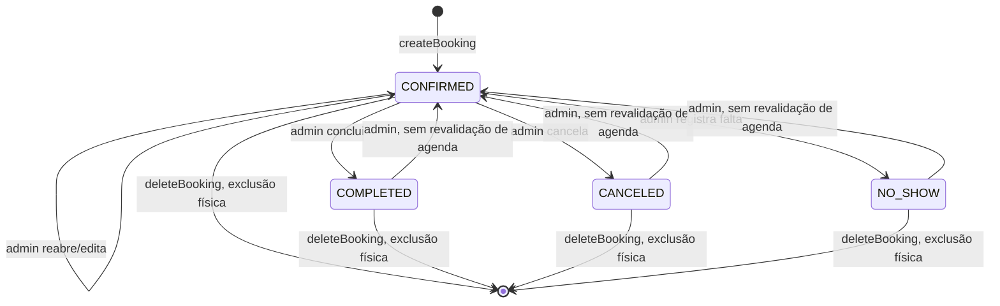
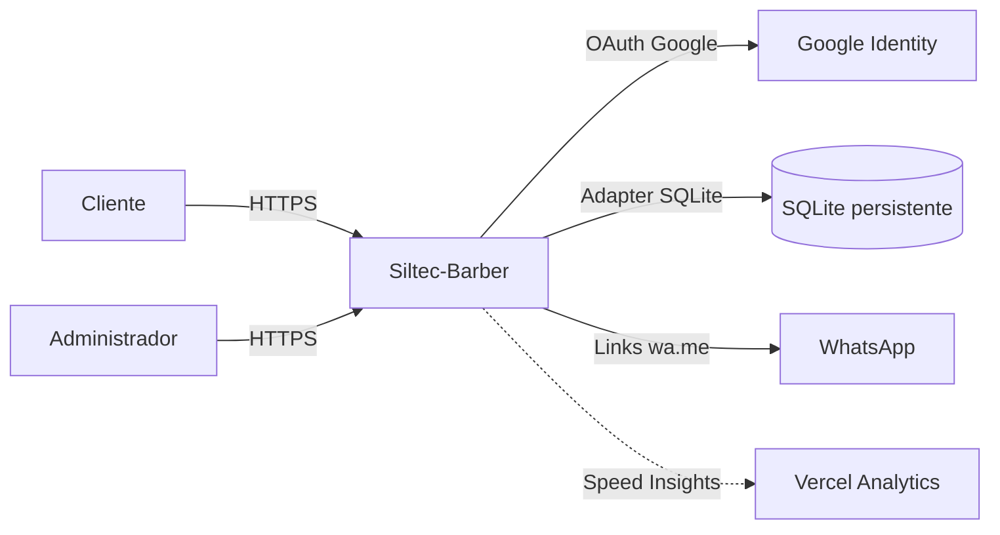
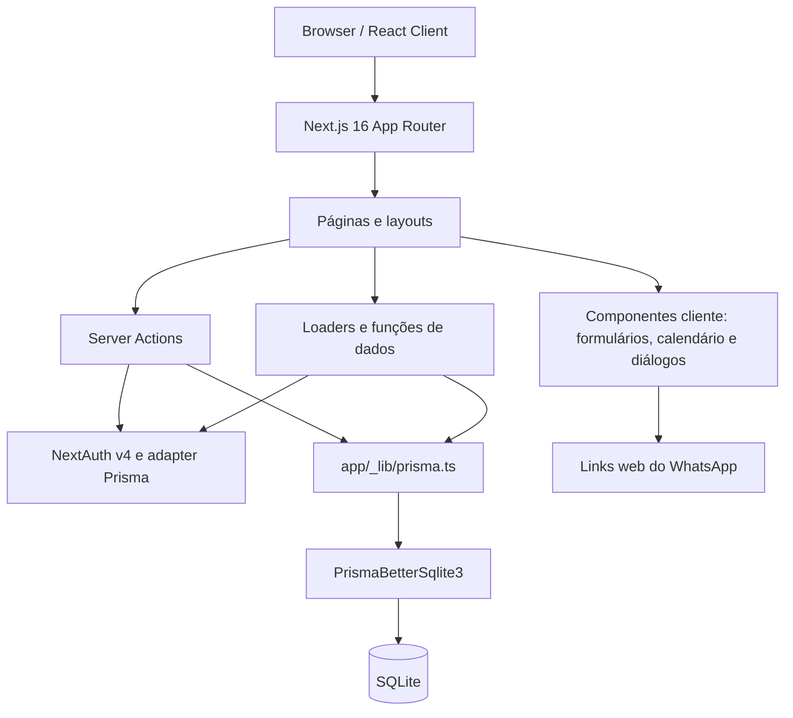
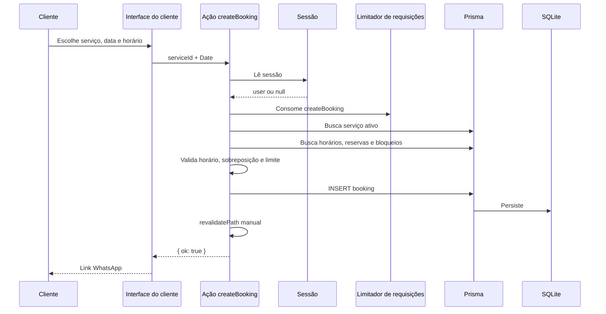

# PRD — Siltec-Barber

> **Baseline funcional e técnica do código atual.** Este documento descreve o que está implementado, suas limitações conhecidas e recomendações para evoluções futuras. Itens marcados como “recomendado” não representam funcionalidades já entregues, salvo indicação explícita em contrário.

## Metadados

| Campo                  | Valor                                                         |
| ---------------------- | ------------------------------------------------------------- |
| Produto                | Siltec-Barber                                                 |
| Tipo                   | Aplicação web full-stack de agendamentos para barbearias      |
| Versão do documento    | 1.1                                                           |
| Data                   | 25/09/2026                                                    |
| Situação               | Baseline atual; itens futuros aguardam priorização            |
| Responsável de produto | Não definido no repositório                                   |
| Idioma da interface    | Português do Brasil                                           |
| Formato monetário      | Real brasileiro (`BRL`)                                       |
| Licença                | Apache License 2.0                                            |
| Fonte principal        | Código, scripts, schema Prisma e configurações do repositório |

## 1. Sumário executivo

O Siltec-Barber é uma aplicação SaaS para descoberta e agendamento de serviços em barbearias. O cliente pode pesquisar barbearias, consultar serviços e horários, autenticar-se com Google, criar e acompanhar reservas e gerar links de confirmação ou lembrete no WhatsApp. O administrador pode gerenciar a agenda, os status dos atendimentos, os serviços, o horário de funcionamento, os bloqueios e o perfil da barbearia.

O domínio é logicamente multi-tenant: usuários, serviços, horários e bloqueios pertencem a uma barbearia. A experiência de marketplace e a operação single-tenant são ativadas por flags de ambiente. Porém, não existe onboarding administrativo autosserviço: a atribuição de `role` e `barbershopId` ainda depende de intervenção manual ou do modo demo.

A implementação atual usa Next.js App Router, React, TypeScript, Server Actions, NextAuth, Prisma e SQLite. A arquitetura é adequada a uma aplicação de instância única com armazenamento persistente. Escalabilidade horizontal segura, múltiplos profissionais por barbearia, pagamento, notificações automáticas e snapshots históricos ainda não fazem parte do escopo entregue.

## 2. Contexto e problema

### 2.1 Problema

Clientes precisam comunicar-se com barbearias por canais informais, encontrar horários ocupados, receber informações desatualizadas e depender de confirmação manual. As barbearias, por sua vez, precisam controlar uma agenda sem depender exclusivamente de agendas pessoais ou de mensagens.

### 2.2 Proposta de valor

- **Para o cliente:** descoberta, comparação, reserva e acompanhamento em uma única experiência.
- **Para a barbearia:** agenda centralizada, controle de serviços, horários, bloqueios, status e dados de contato.
- **Para a operação:** aplicação responsiva, autenticação federada, banco local e modelo preparado para múltiplas barbearias.

### 2.3 Princípios atuais

1. Fluxos de cliente simples e priorizados para dispositivos móveis.
2. Autorização no servidor para ações administrativas.
3. Isolamento lógico por `barbershopId`.
4. Fonte de verdade centralizada no Prisma.
5. Integrações externas por links explícitos, sem depender de envios automáticos de terceiros.
6. Compatibilidade com operação single-tenant e demonstração.

## 3. Objetivos e limites

### 3.1 Objetivos do produto

- Permitir que o cliente encontre barbearias por nome ou serviço.
- Apresentar os dados, serviços, preços, horários e contatos da barbearia.
- Permitir que o cliente escolha data e horário disponível.
- Exigir autenticação antes de persistir uma reserva.
- Impedir reservas passadas, inativas, fora do horário ou conflitantes.
- Oferecer ao administrador uma visão operacional da agenda da loja.
- Controlar serviços, preços, duração, ativação, horários e bloqueios.
- Permitir acompanhamento e cancelamento pelo cliente.
- Suportar comunicação por links do WhatsApp.
- Manter suporte a Google OAuth e sessões persistidas no banco.
- Adaptar a apresentação a uma única barbearia quando desejado.

### 3.2 Fora do escopo entregue

- Pagamento online, divisão de pagamento, comissão ou cobrança de assinatura.
- Envio automático de e-mail, SMS ou WhatsApp API.
- Cadastro público de barbearia e onboarding autosserviço de administrador.
- Escolha de barbeiro ou profissional.
- Agenda e capacidade por profissional.
- Fuso horário por barbearia.
- Horários que atravessem a meia-noite.
- Recorrência, fila de espera, depósito ou confirmação obrigatória.
- Aplicativo mobile nativo.
- Assinatura, fidelidade, cupons, promoções e marketplace financeiro.
- Relatórios financeiros avançados, exportação e registro de auditoria.
- Suporte a múltiplas unidades pertencentes a uma mesma barbearia.
- Recuperação de senha por e-mail; somente login Google está implementado.

### 3.3 Métricas recomendadas

O produto ainda não possui métricas de negócio instrumentadas. Para a próxima fase, recomenda-se medir:

| Métrica                          | Objetivo                                                |
| -------------------------------- | ------------------------------------------------------- |
| Conversão de busca em reserva    | Avaliar a eficiência do catálogo e do fluxo de reserva. |
| Taxa de conclusão da reserva     | Medir perda entre intenção e criação do agendamento.    |
| Taxa de comparecimento e no-show | Avaliar qualidade da agenda e confirmação pelo cliente. |
| Ocupação por loja e serviço      | Identificar capacidade ociosa e gargalos.               |
| Tempo de resposta do admin       | Medir eficiência operacional da barbearia.              |
| Reservas por canal/dispositivo   | Orientar melhorias de aquisição e UX.                   |

## 4. Personas e permissões

| Persona                     | Necessidade principal                    | Acesso atual                                                                         |
| --------------------------- | ---------------------------------------- | ------------------------------------------------------------------------------------ |
| Cliente                     | Encontrar e agendar um serviço           | Navegar, criar e excluir as próprias reservas, editar o próprio perfil               |
| Administrador               | Operar a agenda e o catálogo             | Gerenciar dados, serviços, agenda e horários da própria barbearia                    |
| Operador de demonstração    | Exibir o painel sem provisionamento      | `DEMO_MODE=true` transforma qualquer sessão autenticada em admin da loja configurada |
| Administrador de plataforma | Provisionar tenants e moderar a operação | Não há persona ou interface administrativa implementada                              |

### 4.1 Matriz de autorização

| Recurso             | Cliente | Admin da loja | Modo demo | Não autorizado                         |
| ------------------- | ------: | ------------: | --------: | -------------------------------------- |
| Catálogo público    |     Sim |           Sim |       Sim | Não se aplica                          |
| Próprio perfil      |     Sim |           Sim |       Sim | Alterar perfil de terceiro             |
| Próprias reservas   |     Sim |           Sim |       Sim | Ler reservas de terceiro sem vínculo   |
| Reservas da loja    |     Não |           Sim |       Sim | Admin de outra loja                    |
| Serviços e horários |     Não |           Sim |       Sim | CRUD sem `barbershopId` correspondente |
| Status e bloqueios  |     Não |           Sim |       Sim | Atualizar sem gate admin               |

## 5. Escopo funcional atual

**Legenda de situação:** `Implementado`, `Parcial`, `Não implementado` ou `Recomendação futura`.

### 5.1 Cliente

| ID      | Capacidade                             | Situação         | Critério de aceite atual                                                                                                      |
| ------- | -------------------------------------- | ---------------- | ----------------------------------------------------------------------------------------------------------------------------- |
| CLI-001 | Página inicial e vitrine de barbearias | Implementado     | A página inicial exibe os dados públicos e adapta o destaque quando `SINGLE_BARBERSHOP_ID` está definido.                     |
| CLI-002 | Busca por nome e serviço               | Implementado     | A busca aceita `title`, `service` e tags `recomendados`/`popular`; as tags não representam métricas reais.                    |
| CLI-003 | Detalhe da barbearia                   | Parcial          | Exibe dados, telefones, serviços e horários; o carregador ainda inclui serviços inativos.                                     |
| CLI-004 | Autenticação Google                    | Implementado     | O cliente inicia e mantém sessão por NextAuth/Google; não há login por senha.                                                 |
| CLI-005 | Calendário e horários                  | Implementado     | Horários são derivados da loja, com slots de 30 minutos; conflitos são consultados no cliente.                                |
| CLI-006 | Criar reserva                          | Implementado     | A ação valida login, data futura, serviço ativo, horário, bloqueio, sobreposição e limite global.                             |
| CLI-007 | Listar reservas futuras e passadas     | Parcial          | A separação usa a data, não o status; estados passados podem ser agregados como concluídos.                                   |
| CLI-008 | Cancelar reserva                       | Parcial          | A interface oferece cancelamento, mas a ação executa `DELETE` e não valida passado, status ou idempotência no servidor.       |
| CLI-009 | Reagendar                              | Não implementado | Não há ação dedicada para mover uma reserva existente.                                                                        |
| CLI-010 | WhatsApp                               | Implementado     | Confirmação e lembrete são links `wa.me` abertos pelo cliente.                                                                |
| CLI-011 | Perfil                                 | Implementado     | O cliente pode consultar e atualizar os dados de perfil autorizados.                                                          |
| CLI-012 | Páginas institucionais                 | Implementado     | Sobre, carreiras, parceiros, contato, privacidade, termos e cookies possuem rotas próprias.                                   |
| CLI-013 | Responsividade                         | Implementado     | Layouts e componentes possuem variantes para celular e desktop.                                                               |
| CLI-014 | Single-tenant                          | Parcial          | Página inicial, perfil, rodapé e proxy se adaptam; alguns cabeçalhos e páginas ainda exibem links de catálogo redirecionados. |

### 5.1.1 Detalhes da experiência do cliente

- A página inicial oferece busca, atalhos de seis categorias, lojas recomendadas/populares e próximas reservas quando aplicável.
- A busca real cobre apenas nome da barbearia e nome do serviço; tags, ordenação e busca avançada são heurísticas.
- A reserva abre um sheet, permite escolher serviço, data, horários de 30 minutos e exibe um resumo com serviço, preço, data, horário e loja.
- O login Google é apresentado em diálogo; a seleção de serviço/data não é preservada durante o OAuth.
- `/bookings` é acessível sem sessão, mas exibe dados apenas para usuário autenticado; o histórico revela seis registros por vez.
- O perfil é protegido e permite editar somente o telefone; nome, e-mail e foto vêm da conta Google.
- Telefones podem ser copiados ou abertos via `tel:`; a imagem de mapa é estática e não oferece navegação.
- Contato, carreiras e parceiros são páginas institucionais; carreiras usa candidatura por e-mail e parceiros usa CTA no WhatsApp.

### 5.2 Administrador

| ID      | Capacidade                | Situação     | Critério de aceite atual                                                                                                                |
| ------- | ------------------------- | ------------ | --------------------------------------------------------------------------------------------------------------------------------------- |
| ADM-001 | Gate de acesso            | Implementado | Layout, páginas e ações exigem `Role.BARBER_ADMIN` e `barbershopId`.                                                                    |
| ADM-002 | Dashboard                 | Implementado | Exibe indicadores e resumo operacional da loja.                                                                                         |
| ADM-003 | Agenda diária             | Implementado | Permite navegar por data e consultar os atendimentos da loja.                                                                           |
| ADM-004 | Alterar status            | Implementado | Permite `CONFIRMED`, `COMPLETED`, `CANCELED` e `NO_SHOW` sem grafo de transição.                                                        |
| ADM-005 | Bloquear agenda           | Parcial      | Permite criar/remover bloqueios; a criação não impede bloqueios sobrepostos e só rejeita reservas cujo início está dentro do intervalo. |
| ADM-006 | Gerenciar serviços        | Implementado | Permite criar, editar, ativar, desativar e excluir serviços elegíveis.                                                                  |
| ADM-007 | Horários de funcionamento | Parcial      | Permite carregar e salvar sete horários; a validação não garante dias da semana distintos.                                              |
| ADM-008 | Perfil da barbearia       | Implementado | Permite atualizar identidade, endereço, descrição, telefones e imagem.                                                                  |
| ADM-009 | Tour inicial              | Implementado | O tour é exibido enquanto `onboardingDoneAt` não existe.                                                                                |
| ADM-010 | Navegação responsiva      | Implementado | A barra lateral no desktop e a barra inferior no celular suportam o painel.                                                             |
| ADM-011 | Limite de escrita         | Implementado | Escritas administrativas compartilham 20 requisições por minuto e por barbearia.                                                        |
| ADM-012 | Revalidação de rotas      | Parcial      | Cada ação chama `revalidatePath` manualmente, mas a cobertura é incompleta.                                                             |

### 5.2.1 Detalhes da operação

- Dashboard e agenda operam em um único dia selecionado; não oferecem visão semanal ou mensal.
- As métricas do dashboard incluem total de reservas, faturamento previsto, minutos de cadeira, concluídos e faltas/cancelamentos.
- Faturamento previsto e minutos incluem `NO_SHOW` e usam preço/duração atuais; não são pagamentos realizados nem snapshots.
- A agenda é uma lista cronológica de cards, não uma timeline de ocupação com capacidade, faixas de horário ou sobreposições visuais.
- Os controles de status permitem concluir, registrar falta, cancelar ou reabrir sem máquina de estados.
- Bloqueios oferecem presets de almoço e dia inteiro; a criação verifica somente reservas cujo início está no intervalo e permite bloqueios sobrepostos.
- Serviços exibem contagem de ativos/inativos, preço médio dos ativos, duração média dos ativos e total de reservas.
- O tour de onboarding possui quatro etapas visuais e grava `onboardingDoneAt` ao ser fechado ou desmontado.

### 5.3 Plataforma e operação

| ID      | Capacidade                          | Situação         | Critério de aceite atual                                                                                |
| ------- | ----------------------------------- | ---------------- | ------------------------------------------------------------------------------------------------------- |
| SYS-001 | Multi-tenant lógico                 | Implementado     | Dados operacionais são relacionados a uma barbearia; reservas precisam ser escopadas via `service`.     |
| SYS-002 | Single-tenant por ambiente          | Parcial          | `SINGLE_BARBERSHOP_ID` adapta a home e redireciona `/barbershops/**`; não é uma política de isolamento. |
| SYS-003 | Modo demo                           | Implementado     | `DEMO_MODE=true` + `DEMO_BARBERSHOP_ID` sobrescreve a sessão com papel/loja de admin.                   |
| SYS-004 | Seed                                | Implementado     | Cria 10 barbearias e 6 serviços por loja, sem usuário admin.                                            |
| SYS-005 | Diagnóstico de deploy               | Parcial          | `instrumentation.ts` registra avisos; não interrompe a aplicação nem cobre todos os provedores.         |
| SYS-006 | Persistência SQLite                 | Implementado     | Banco local via PrismaBetterSqlite3; exige armazenamento gravável e persistente.                        |
| SYS-007 | Análise de bundle                   | Implementado     | `ANALYZE=true` habilita `@next/bundle-analyzer`.                                                        |
| SYS-008 | Testes automatizados no repositório | Não implementado | Não há `test` script, executor ou suíte versionada.                                                     |
| SYS-009 | CI                                  | Não implementado | Não foi encontrado workflow de CI versionado.                                                           |
| SYS-010 | Documentação técnica                | Implementado     | Este PRD, `docs/README.md` e o histórico PostgreSQL estão documentados.                                 |

### 5.3.1 Limites de requisição e resiliência

- Criação de reserva: 5 requisições/minuto por usuário.
- Consulta de intervalos: 30 requisições/minuto por usuário.
- Consulta de horários: 30 requisições/minuto por IP derivado.
- Escritas administrativas: 20 requisições/minuto por barbearia, compartilhadas entre usuários.
- `deleteBooking` e onboarding não consomem rate limit explícito.
- Falhas inesperadas do armazenamento do limitador falham abertas; leituras negadas retornam array vazio.

## 6. jornadas principais

### 6.1 Descobrir e reservar

1. O cliente acessa a home ou `/barbershops`.
2. Pesquisa por nome, serviço ou tag.
3. Abre `/barbershops/[id]`.
4. Escolhe um serviço e uma data.
5. O frontend calcula slots pela duração e remove intervalos ocupados/bloqueados.
6. Se a sessão exigir autenticação, o cliente entra com Google.
7. O servidor executa novamente todas as validações.
8. A reserva é criada como `CONFIRMED`.
9. O cliente recebe um link WhatsApp para confirmação.

### 6.2 Acompanhar e cancelar

1. O cliente abre `/bookings`.
2. Reservas com data futura são exibidas na lista “futuros”; as demais, na lista de concluídos/histórico.
3. A interface permite gerar mensagem WhatsApp.
4. Para cancelamento futuro, o componente cliente chama `deleteBooking`.
5. A ação valida sessão e propriedade/admin, então exclui fisicamente a linha.

### 6.3 Operar a agenda

1. O admin acessa `/dashboard` ou `/schedule`.
2. O layout valida role e `barbershopId`.
3. O loader da agenda recebe o ID já autorizado pela página.
4. O admin navega entre datas e atualiza status.
5. O admin cria um bloqueio para interromper um intervalo.
6. O sistema revalida as rotas de dashboard/schedule manualmente.

### 6.4 Operar como single-tenant

1. `SINGLE_BARBERSHOP_ID` é configurado no ambiente.
2. A página inicial carrega diretamente a loja configurada.
3. `proxy.ts` redireciona `/barbershops` e descendentes para `/`.
4. O restante do sistema continua multi-tenant no banco.

## 7. Regras de negócio e invariantes

| ID     | Regra                                                                                                     |
| ------ | --------------------------------------------------------------------------------------------------------- |
| BR-001 | A barbearia de uma reserva é derivada do `serviceId`; não existe `barbershopId` em `Booking`.             |
| BR-002 | Uma reserva deve pertencer ao futuro no momento da criação.                                               |
| BR-003 | Serviço inexistente ou inativo impede a criação.                                                          |
| BR-004 | O slot precisa existir no horário de funcionamento da loja.                                               |
| BR-005 | Os horários começam em intervalos de 30 minutos e a duração precisa terminar antes do fechamento.         |
| BR-006 | Todos os serviços da mesma barbearia disputam uma única capacidade.                                       |
| BR-007 | Apenas `CANCELED` é ignorado nos conflitos; `COMPLETED` e `NO_SHOW` continuam ocupando intervalos.        |
| BR-008 | O limite global é de três reservas futuras `CONFIRMED` por usuário, somando todas as lojas.               |
| BR-009 | O bloqueio de agenda usa sobreposição de intervalos para bloquear novas reservas.                         |
| BR-010 | A criação de bloqueio só rejeita reservas cujo início está dentro do bloqueio.                            |
| BR-011 | Datas usam `Date`/`date-fns` e o fuso horário do host; não existe fuso persistido.                        |
| BR-012 | Horários e bloqueios devem terminar no mesmo dia; não há suporte a operações que atravessem a meia-noite. |
| BR-013 | O preço e a duração não são copiados para a reserva.                                                      |
| BR-014 | Serviço com qualquer reserva não pode ser deletado.                                                       |
| BR-015 | O cancelamento do cliente exclui fisicamente a reserva.                                                   |
| BR-016 | Listas de cliente e indicadores usam data/status de maneiras diferentes; ver riscos e dívida técnica.     |
| BR-017 | WhatsApp é um link no cliente; o servidor não envia mensagens.                                            |
| BR-018 | Métricas financeiras usam preços atuais do serviço, sem snapshot.                                         |

### 7.1 Estados da reserva



Não há transição no cliente para `CANCELED`; a interface usa hard delete.

### 7.1.1 Semântica atual dos status

| Status      | Ocupa agenda | Entra no limite de três | Entra no faturamento/minutos |
| ----------- | -----------: | ----------------------: | ---------------------------: |
| `CONFIRMED` |          Sim |          Sim, se futuro |                          Sim |
| `COMPLETED` |          Sim |                     Não |                          Sim |
| `CANCELED`  |          Não |                     Não |                          Não |
| `NO_SHOW`   |          Sim |                     Não |                          Sim |

A tabela usa preço e duração atuais; não representa pagamento realizado nem snapshot histórico.

### 7.2 Estados do serviço

| Estado              | Comportamento atual                                                                     |
| ------------------- | --------------------------------------------------------------------------------------- |
| `isActive=true`     | Aparece no catálogo e pode receber reservas.                                            |
| `isActive=false`    | O detalhe ainda pode exibi-lo e a busca pode encontrar a loja; `createBooking` rejeita. |
| Serviço com reserva | Exclusão proibida; a interface orienta desativação.                                     |

## 8. Arquitetura da informação e rotas

### 8.1 Rotas do cliente

| Rota                | Responsabilidade                                                                                            |
| ------------------- | ----------------------------------------------------------------------------------------------------------- |
| `/`                 | Home, vitrine e entrada single-tenant.                                                                      |
| `/barbershops`      | Catálogo e busca.                                                                                           |
| `/barbershops/[id]` | Detalhe, serviços, horários e reserva.                                                                      |
| `/bookings`         | Reservas futuras e histórico do usuário.                                                                    |
| `/perfil`           | Dados do usuário autenticado.                                                                               |
| `/login`            | Login unificado: botão Google **sempre** visível (porta do OAuth); formulário de e-mail/senha **apenas para testes** e inerte sem `TEST_LOGIN_ENABLED`. |
| `/carreiras`        | Conteúdo institucional.                                                                                     |
| `/parceiros`        | Conteúdo institucional/parcerias.                                                                           |
| `/contato`          | Informação de contato/WhatsApp.                                                                             |
| `/sobre`            | Conteúdo institucional.                                                                                     |
| `/privacidade`      | Informações de privacidade.                                                                                 |
| `/termos`           | Termos de uso.                                                                                              |
| `/cookies`          | Explicação de cookies.                                                                                      |

### 8.2 Rotas administrativas

| Rota         | Responsabilidade                            |
| ------------ | ------------------------------------------- |
| `/dashboard` | Indicadores e resumo da operação.           |
| `/schedule`  | Agenda diária, status e bloqueios.          |
| `/services`  | Gestão do catálogo de serviços.             |
| `/settings`  | Perfil da loja e horários de funcionamento. |

### 8.3 Endpoint HTTP

O único endpoint HTTP em `app/api` é:

- `GET/POST /api/auth/[...nextauth]`: autenticação NextAuth.

As demais operações usam Server Actions e funções de servidor; não há API REST/GraphQL pública para reservas ou administração.

### 8.4 UX, SEO e conteúdo

- O cabeçalho oferece busca, navegação, menu de usuário, CTA de agendamento e barra de progresso; a busca compacta filtra apenas elementos marcados para busca local.
- A página de resultados possui alguns controles visuais de filtro, ordenação, visualização e “carregar mais” sem implementação funcional ou paginação.
- Avaliações, quantidade de clientes, regiões, satisfação e características das barbearias são valores fixos no código, não dados de uma avaliação real.
- Não há integração de mapa, geolocalização, filtro por distância, preço, avaliação ou horário.
- Perfil, 404 e painel usam metadados de noindex; `/bookings` não declara noindex e não há sitemap/robots dedicado.
- A política de privacidade contém referências históricas a Neon/Vercel que divergem do runtime SQLite atual e devem ser revisadas.
- A página de termos descreve regras de cancelamento, pagamento e responsabilidade, mas o sistema não processa pagamento.
- O analytics do layout é Vercel Speed Insights; não há consentimento/preferências de cookies implementados.

## 9. Arquitetura técnica

### 9.1 Visão de contexto



### 9.2 Containers e responsabilidades



### 9.3 Organização do código

| Diretório                      | Responsabilidade                                                                                    |
| ------------------------------ | --------------------------------------------------------------------------------------------------- |
| `app/(customer)`               | Páginas, layouts e componentes voltados ao cliente.                                                 |
| `app/(admin)`                  | Páginas, actions, loaders, schemas, componentes e formatação do painel.                             |
| `app/_actions`                 | Server Actions compartilhadas, incluindo criação/exclusão de reservas, leituras de agenda e perfil. |
| `app/_data`                    | Loaders de dados compartilhados.                                                                    |
| `app/_lib`                     | Autenticação, Prisma, limite de requisições, WhatsApp, telefones, horários e utilitários.           |
| `app/_components`              | Componentes compartilhados.                                                                         |
| `app/_providers`               | Provedores da aplicação.                                                                            |
| `app/api/auth/[...nextauth]`   | Handler do NextAuth.                                                                                |
| `prisma/schema.prisma`         | Fonte do modelo relacional.                                                                         |
| `prisma/migrations`            | Migrações SQLite ativas.                                                                            |
| `prisma/migrations-postgresql` | Histórico arquivado; não deve ser aplicado.                                                         |
| `proxy.ts`                     | Redirecionamento single-tenant; não é autenticação.                                                 |
| `instrumentation.ts`           | Diagnóstico de deploy no runtime Node.                                                              |

### 9.4 Limite de segurança

- O arquivo `proxy.ts` é a convenção ativa do Next 16; não existe `middleware.ts`.
- O proxy é uma camada de roteamento, não uma autorização.
- `requireBarbershopAdmin` é o gate explícito de role e tenant para páginas e actions.
- Os loaders admin confiam no `barbershopId` recebido e não fazem autenticação por conta própria.
- Server Actions devem ser tratadas como endpoints públicos: validar sessão, role, tenant e payload em cada operação.
- Dados de sessão são persistidos no SQLite via adapter do Prisma.
- O modo demo é uma elevação de privilégio intencional e deve permanecer desligado em produção.

### 9.5 Fluxo de criação de reserva



A validação de conflito e o limite de três são operações de verificação seguidas de inserção e podem ser ultrapassados por requisições concorrentes.

### 9.6 Cache e revalidação

- O projeto não implementa uma camada de cache de domínio explícita.
- As actions chamam `revalidatePath` individualmente.
- A cobertura é manual e incompleta; mudanças de serviço, horário e reserva não revalidam todas as páginas afetadas.
- `revalidateTag` não é usado; quando adotado no Next 16, exige um perfil de cache.
- O cache local do Next não deve ser pressuposto como compartilhado entre múltiplas instâncias.

## 10. Stack e dependências

| Camada                 | Tecnologia                       | Versão/estado                                                                                     |
| ---------------------- | -------------------------------- | ------------------------------------------------------------------------------------------------- |
| Runtime                | Node.js                          | Faixas do Prisma: `^20.19`, `^22.12` ou `>=24`; preferir `24.15+` para ferramentas de atualização |
| Gerenciador de pacotes | pnpm                             | `10.34.5`, lockfile v9                                                                            |
| Framework              | Next.js                          | `16.3.3`                                                                                          |
| Ambiente de UI         | React                            | `19.2.8`                                                                                          |
| Linguagem              | TypeScript                       | `5.9.3`, strict/noEmit                                                                            |
| Roteamento/UI          | Next App Router                  | Server Components, client components e Server Actions                                             |
| Autenticação           | NextAuth                         | `4.24.15`                                                                                         |
| Adapter OAuth          | `@auth/prisma-adapter`           | `2.11.3`                                                                                          |
| ORM                    | Prisma                           | `7.10.0`                                                                                          |
| Driver de banco        | `@prisma/adapter-better-sqlite3` | `7.10.0`                                                                                          |
| Driver nativo          | `better-sqlite3`                 | `12.11.1`                                                                                         |
| Banco                  | SQLite                           | Arquivo local persistente                                                                         |
| Validação              | Zod                              | `4.5.4`                                                                                           |
| Datas                  | date-fns                         | `4.4.0`                                                                                           |
| Calendário             | React Day Picker                 | `9.14.0`                                                                                          |
| Formulários            | React Hook Form                  | `7.87.0`                                                                                          |
| Estilo                 | Tailwind CSS                     | `4.3.3`, CSS-first                                                                                |
| Componentes            | shadcn/ui + Radix UI             | Componentes versionados; aliases parcialmente inconsistentes                                      |
| Ícones                 | Lucide React                     | `0.577.0`                                                                                         |
| Feedback               | Sonner                           | `2.0.8`                                                                                           |
| Tour                   | Driver.js                        | `1.8.0`                                                                                           |
| Progresso              | `@bprogress/next`                | `3.2.12`                                                                                          |
| Limite de requisições  | `rate-limiter-flexible`          | `11.2.0`                                                                                          |
| Imagens                | Next Image                       | HTTPS remoto amplo, SVG com anexo/CSP sandbox                                                     |
| Análise                | `@next/bundle-analyzer`          | `16.3.4`                                                                                          |
| Observabilidade        | Vercel Speed Insights            | `1.3.1` disponível no pacote                                                                      |
| Qualidade              | ESLint / Prettier                | `9.39.5` / `3.9.6`                                                                                |
| Commits                | Husky / git-commit-msg-linter    | `9.1.7` / `5.0.9`, com hook legado de caminho fixo                                                |
| Testes                 | TestSprite MCP                   | Externo, iniciado via `npx @latest`; sem suíte versionada                                         |

## 11. Modelo de dados

### 11.1 Entidades

```mermaid
erDiagram
  BARBERSHOP ||--o{ BARBERSHOP_SERVICE : oferece
  BARBERSHOP ||--o{ OPENING_HOUR : define
  BARBERSHOP ||--o{ SCHEDULE_BLOCK : bloqueia
  BARBERSHOP ||--o{ USER : emprega
  USER ||--o{ ACCOUNT : autentica
  USER ||--o{ SESSION : possui
  USER ||--o{ BOOKING : realiza
  BARBERSHOP_SERVICE ||--o{ BOOKING : recebe

  USER {
    string id PK
    string email UK
    string phone
    Role role
    datetime onboardingDoneAt
    string barbershopId FK
  }
  BARBERSHOP {
    string id PK
    string name
    string address
    string phones
    string description
    string imageUrl
  }
  BARBERSHOP_SERVICE {
    string id PK
    string name
    string price Decimal
    int durationMinutes
    boolean isActive
    string barbershopId FK
  }
  BOOKING {
    string id PK
    string userId FK
    string serviceId FK
    datetime date
    BookingStatus status
  }
  OPENING_HOUR {
    string id PK
    int weekday
    string opensAt
    string closesAt
    boolean isClosed
    string barbershopId FK
  }
  SCHEDULE_BLOCK {
    string id PK
    datetime startsAt
    datetime endsAt
    string reason
    string barbershopId FK
  }
  VERIFICATION_TOKEN {
    string identifier PK
    string token PK
    datetime expires
  }
```

- Enums Prisma: `Role` (`CUSTOMER`, `BARBER_ADMIN`) e `BookingStatus` (`CONFIRMED`, `COMPLETED`, `CANCELED`, `NO_SHOW`).

### 11.2 Campos e relacionamentos críticos

- `User.role` aceita `CUSTOMER` e `BARBER_ADMIN`.
- `User.barbershopId` é opcional; um admin sem loja não passa no gate.
- `Account` armazena identidade OAuth e tokens de acesso/refresh; `Session` armazena sessões de banco do NextAuth.
- `VerificationToken` é uma entidade independente do NextAuth.
- `Barbershop.phones` é uma string JSON, não uma relação.
- `BarbershopService.price` é `Decimal`; a interface converte para `Number` na borda.
- `Booking` referencia `User` e `BarbershopService`; não referencia diretamente a loja.
- `OpeningHour.weekday` usa `0` para domingo e possui restrição única por loja/dia.
- `ScheduleBlock` é de toda a loja, sem profissional ou serviço.
- `RateLimit` é uma tabela global de chaves/pontos/expiração.
- Não há campos de fuso horário, profissional, snapshot de preço/duração, notas, pagamento, recorrência ou auditoria.

### 11.3 Integridade e exclusão em cascata

| Relação                                | Comportamento Prisma |
| -------------------------------------- | -------------------- |
| User → Account/Session                 | `onDelete: Cascade`  |
| Barbershop → Service/OpeningHour/Block | `onDelete: Cascade`  |
| Barbershop → User staff                | `onDelete: SetNull`  |
| Booking → User                         | `onDelete: Restrict` |
| Booking → Service                      | `onDelete: Restrict` |

## 12. APIs e Server Actions

### 12.1 Ações compartilhadas

| Arquivo                                     | Operação                                                                  |
| ------------------------------------------- | ------------------------------------------------------------------------- |
| `app/_actions/create-booking.ts`            | Cria reserva após autenticação, limite de requisições e regras de agenda. |
| `app/_actions/delete-booking.ts`            | Exclui reserva por propriedade ou admin da mesma loja.                    |
| `app/_actions/get-bookings.ts`              | Retorna intervalos indisponíveis e horários de serviço.                   |
| `app/_actions/update-profile.ts`            | Atualiza dados do usuário autenticado.                                    |
| `app/_data/get-confirmed-bookings.ts`       | Lista reservas por data futura.                                           |
| `app/_data/get-concluded-bookings.ts`       | Lista reservas por data passada.                                          |
| `app/_data/get-barbershop-by-id.ts`         | Busca loja e serviços.                                                    |
| `app/_data/getBarbershopsBySearchParams.ts` | Busca/filtra lojas.                                                       |
| `app/_data/get-opening-hours.ts`            | Consulta horários públicos.                                               |

### 12.2 Ações administrativas

| Arquivo                                         | Operações                                           |
| ----------------------------------------------- | --------------------------------------------------- |
| `app/(admin)/_actions/services.ts`              | Criar, editar, ativar, desativar e excluir serviço. |
| `app/(admin)/_actions/opening-hours.ts`         | Salvar horários de funcionamento.                   |
| `app/(admin)/_actions/schedule-blocks.ts`       | Criar e remover bloqueios.                          |
| `app/(admin)/_actions/update-booking-status.ts` | Alterar status de reserva.                          |
| `app/(admin)/_actions/barbershop.ts`            | Atualizar perfil da loja.                           |
| `app/(admin)/_actions/onboarding.ts`            | Marcar onboarding como concluído.                   |

### 12.3 Revalidação e respostas

- Ações normalmente retornam `{ ok: true }` ou `{ ok: false, error }`.
- `revalidatePath` é chamado localmente em cada action.
- Não há camada centralizada de invalidação.
- O onboarding não revalida rota.
- A criação de reserva não revalida `/` no modo single-tenant, embora a home apresente reservas futuras.
- Serviços não revalidam `/barbershops/[id]`.
- Horários não revalidam `/` nem o detalhe dinâmico.

## 13. Configuração e ambiente

### 13.1 Variáveis

| Variável               | Obrigatória/uso        | Observação                                                                                          |
| ---------------------- | ---------------------- | --------------------------------------------------------------------------------------------------- |
| `DATABASE_URL`         | Obrigatória            | Deve iniciar com `file:`; exemplo `file:./prisma/dev.db`.                                           |
| `NEXT_AUTH_SECRET`     | Recomendada            | Segredo de 32+ caracteres por política do projeto; o runtime NextAuth também aceita fallback.       |
| `NEXTAUTH_SECRET`      | Fallback               | Reconhecido pelo NextAuth e pelo diagnóstico, mas não é a variável canônica.                        |
| `AUTH_SECRET`          | Fallback NextAuth      | Reconhecido pelo NextAuth, mas não pelo diagnóstico local.                                          |
| `GOOGLE_CLIENT_ID`     | Login Google           | Necessária para autenticação.                                                                       |
| `GOOGLE_CLIENT_SECRET` | Login Google           | Necessária para autenticação.                                                                       |
| `NEXTAUTH_URL`         | Produção               | Deve ser pública e não localhost.                                                                   |
| `SINGLE_BARBERSHOP_ID` | Operação single-tenant | Somente apresentação/redirect; não cria isolamento.                                                 |
| `DEMO_MODE`            | Demonstração           | `true` exige `DEMO_BARBERSHOP_ID`.                                                                  |
| `DEMO_BARBERSHOP_ID`   | Demonstração           | Loja que todos os logados administrarão.                                                            |
| `TEST_LOGIN_ENABLED`   | Teste local            | `true` habilita o **formulário de e-mail/senha** da rota `/login` (a página e o botão Google existem com ou sem a flag) e o seed das contas de teste. **Nunca em produção.** |
| `TEST_LOGIN_PASSWORD`  | Teste local            | Senha única das contas de teste; fica só no `.env.local` (comentada no `.env.example`).             |
| `ANALYZE`              | Build/análise          | `true` habilita bundle analyzer.                                                                    |
| `NODE_ENV`             | Runtime                | Usado nas verificações de produção.                                                                 |

### 13.2 Carregamento de env

O `prisma.config.ts` não usa dotenv. Ele implementa um parser simples para linhas `KEY=value`, carrega `.env` e depois `.env.local` e só preenche chaves ausentes. Portanto:

1. O ambiente do processo vence.
2. `.env` vence `.env.local` em duplicatas.
3. Valores multilinha e `export KEY=...` não são suportados pelo parser.
4. O arquivo de exemplo não lista as flags de tenant, demo ou análise; as flags de login de teste aparecem nele apenas comentadas.

### 13.3 Diagnóstico de deployment

`instrumentation.ts` chama `checkDeployment` no runtime Node. As verificações atuais checam principalmente:

- `DATABASE_URL` ausente ou não-`file:`.
- Segredo ausente ou abaixo de 32 caracteres.
- `DEMO_MODE` sem ID.
- IDs single-tenant e demo divergentes.
- `NEXTAUTH_URL` ausente/localhost em produção.
- Demo mode ligado em produção.

As verificações são logs informativos; não substituem validação de credenciais Google, existência da barbearia ou teste de conectividade real.

> **Lacuna:** `TEST_LOGIN_ENABLED` **não** é verificado pelo diagnóstico — habilitar a flag em produção não gera nenhum aviso de startup (ver RISK-021).

## 14. Segurança e privacidade

### 14.1 Controles atuais

- Google OAuth via NextAuth.
- Estratégia de sessão persistida no banco.
- Gate no servidor para role e tenant.
- Consultas de reserva escopadas por `service.barbershopId` quando são de uma loja.
- Rate limit persistido em `RateLimit`.
- Zod em várias actions administrativas.
- Valores de preço convertidos explicitamente de Decimal.
- Nomes de usuário e conteúdo renderizados pelo React/Next.
- Rota de teste `/login`: action inerte (redireciona) quando `TEST_LOGIN_ENABLED` não é `true`; senha comparada por hash SHA-256 com `timingSafeEqual`; cria sessão no mesmo formato do NextAuth (estratégia database). A página é renderizada sempre (`dynamic = "force-dynamic"`, flag lida em runtime) e protege **só o formulário**; o botão Google é o único ponto da interface que chama `signIn("google")`.

### 14.2 Controles ausentes ou incompletos

- Não há `server-only` nos carregadores de dados admin.
- Os loaders admin não validam sessão/tenant por conta própria.
- Não há auditoria de alterações administrativas.
- Não há exclusão/exportação de dados pessoais.
- Não há consentimento ou centro de preferências de cookies identificado.
- Não há política de retenção/anonimização de contas e sessões.
- O IP de leitura depende do primeiro valor de `x-forwarded-for`.
- `remotePatterns` aceita qualquer host HTTPS e SVG tem configuração permissiva com sandbox.
- Falhas inesperadas do limitador de requisições falham abertas.
- Existe uma credencial plaintext no `opencode.jsonc`; não deve ser reproduzida.
- A rota de teste `/login` não tem rate limit próprio e usa uma única senha para todas as contas de teste; é segura apenas com `TEST_LOGIN_ENABLED` desligada, e o diagnóstico de produção não monitora a flag (RISK-021).

## 15. Requisitos não funcionais

| ID      | Área             | Expectativa                                                                                           |
| ------- | ---------------- | ----------------------------------------------------------------------------------------------------- |
| RNF-001 | Segurança        | Nunca permitir que um admin leia/escreva outra loja; validar no limite de cada loader/action.         |
| RNF-002 | Autenticação     | Sessão no servidor, segredo gerenciado fora do repositório e rotação documentada.                     |
| RNF-003 | Integridade      | Não aceitar reserva duplicada, limite excedido ou corrupção de agenda sob concorrência.               |
| RNF-004 | Privacidade      | Proteger e-mail, telefone, tokens OAuth e tokens de sessão no banco/backups.                          |
| RNF-005 | Responsividade   | Fluxos principais devem funcionar em celular e desktop.                                               |
| RNF-006 | Acessibilidade   | Usar rótulos, foco, teclado e semântica; auditoria WCAG ainda não formalizada.                        |
| RNF-007 | Performance      | Definir limites de orçamento, paginação e consultas; hoje não há SLO formal.                          |
| RNF-008 | Escalabilidade   | SQLite pressupõe instância única e armazenamento persistente; escala horizontal requer revisão.       |
| RNF-009 | Disponibilidade  | Definir SLO, monitoramento, backup, restauração e operação de incidente.                              |
| RNF-010 | Observabilidade  | Adicionar logs estruturados, tracing e relatório de erros; hoje há apenas console/diagnóstico.        |
| RNF-011 | Manutenibilidade | TypeScript strict, ESLint flat, Prettier e limites de módulo.                                         |
| RNF-012 | Compatibilidade  | Suportar o Node/Next versionados e documentar breaking changes do framework.                          |
| RNF-013 | Localização      | Interface e moeda em pt-BR/BRL; fuso horário de negócio ainda precisa ser definido.                   |
| RNF-014 | Testabilidade    | E2E com TestSprite versionado (45 cenários, 95,7% aprovados); faltam suíte unitária, integração e CI. |

## 16. Operação, build e deploy

### 16.1 Comandos oficiais

```bash
pnpm install
pnpm exec prisma migrate deploy
pnpm exec prisma generate
pnpm exec prisma db seed   # dados de demonstração (idempotente)
pnpm dev
pnpm build
pnpm start
```

Verificações disponíveis:

```bash
pnpm lint
pnpm exec eslint <path>
pnpm exec next typegen
pnpm exec tsc --noEmit
pnpm exec prisma validate
pnpm exec prettier --check <files>
```

Não existe script dedicado de typecheck, testes ou formatação.

### 16.2 Dependência de persistência

O app usa `file:./prisma/dev.db` e um adapter SQLite local. Em produção, o processo precisa de armazenamento gravável e persistente. Em servidor efêmero, o banco pode desaparecer a cada deploy ou reinício.

### 16.3 Dependências nativas e build

`next.config.mjs` mantém `@prisma/adapter-better-sqlite3` e `better-sqlite3` como `serverExternalPackages`. O bundle deve preservar esses módulos nativos no ambiente Node.

### 16.4 Ausências operacionais

Não foram encontrados no escopo atual:

- Dockerfile ou imagem de container.
- Kubernetes/Helm/Terraform.
- Workflow de CI.
- Job de backup automático.
- Endpoint de health/readiness.
- Fila de jobs.
- Error tracking externo.
- Estratégia oficial de rollback.

Essas ausências não impedem o deploy local, mas devem ser tratadas como decisões operacionais explícitas.

## 17. Estratégia de testes

### 17.1 Estado atual

Não há suíte de testes unitários ou de integração, nem pipeline de CI. O E2E é feito com o **TestSprite** (MCP externo iniciado por `npx @testsprite/testsprite-mcp@latest`) e seus artefatos estão versionados no repositório:

| Artefato                                   | Caminho                                                                                                         |
| ------------------------------------------ | --------------------------------------------------------------------------------------------------------------- |
| Plano de testes (45 cenários, TC001–TC045) | [`testsprite_tests/testsprite_frontend_test_plan.json`](../testsprite_tests/testsprite_frontend_test_plan.json) |
| Scripts Playwright gerados                 | [`testsprite_tests/TC*.py`](../testsprite_tests)                                                                |
| Relatório consolidado (3 lotes)            | [`testsprite_tests/testsprite-mcp-test-report.md`](../testsprite_tests/testsprite-mcp-test-report.md)           |

**Resultado das execuções de 24–25/09/2026** (modo produção, `pnpm build` + `pnpm start`, com login de teste habilitado):

| Métrica                   | Valor                                             |
| ------------------------- | ------------------------------------------------- |
| Execuções / testes únicos | 24 / 23 (TC018 executado 2×)                      |
| Aprovados                 | 22 de 23 (**95,7%**)                              |
| Falhas                    | 1 — TC013 (sessão client-side defasada pós-login) |
| Bloqueados                | 0 (o bloqueio original do TC018 foi resolvido)    |
| Cobertura                 | Cliente/público + as 4 telas do painel admin      |

A autenticação nos testes usa a rota de teste `/login` com três contas criadas pelo seed sob `TEST_LOGIN_ENABLED`: `cliente@teste.dev` (3 reservas), `vazio@teste.dev` (zero reservas — estado vazio) e `admin@teste.dev` (painel). Achados de qualidade registrados no relatório: TC001 é provável falso-positivo por asserção fraca e `deleteBooking` faz hard delete (RISK-008); o achado "diálogo de login sem acesso às credenciais" foi resolvido ao unificar os pontos de entrada da autenticação em `/login`.

Validações de código atualmente disponíveis:

| Comando                      | Resultado/uso                                                                  |
| ---------------------------- | ------------------------------------------------------------------------------ |
| `pnpm build`                 | Compila, gera tipos e páginas de produção.                                     |
| `pnpm exec next typegen`     | Gera tipos de rota sem build completo.                                         |
| `pnpm exec tsc --noEmit`     | Verifica TypeScript.                                                           |
| `pnpm exec prisma validate`  | Valida schema/configuração Prisma.                                             |
| `pnpm lint`                  | Verifica lint; há warning conhecido de React Compiler no formulário de perfil. |
| `pnpm exec prettier --check` | Verifica formatação.                                                           |

### 17.2 Matriz mínima recomendada

| Área          | Testes mínimos                                                                    |
| ------------- | --------------------------------------------------------------------------------- |
| Autenticação  | Login, callback, sessão expirada, cliente vs admin, modo demo.                    |
| Tenant        | Admin A não acessa dados de B; loader/action rejeita ID não autorizado.           |
| Reserva       | Futuro/passado, serviço inativo, horário, sobreposição, limite, cap e rate limit. |
| Concorrência  | Duas requisições no mesmo horário; quatro requisições para ultrapassar o limite.  |
| Agenda        | Bloqueios sobrepostos, meia-noite, duração, alteração de serviço e abertura.      |
| Serviços      | CRUD, desativar, excluir com reserva e filtro de inativos.                        |
| Ciclo de vida | Status, métricas, cancelamento e exclusão física.                                 |
| E2E           | Home → busca → login → reserva → WhatsApp; agenda admin → status/bloqueio.        |
| Deploy        | Migration, segredo, URL, banco persistente e diagnósticos de startup.             |

## 18. Riscos e dívida técnica

| ID       | Severidade | Risco                                                                           | Impacto                                                              | Mitigação recomendada                                             |
| -------- | ---------: | ------------------------------------------------------------------------------- | -------------------------------------------------------------------- | ----------------------------------------------------------------- |
| RISK-001 |    Crítica | Conflito e limite de reservas são verificação seguida de inserção               | Reserva duplicada e excedente do limite                              | Transação/lock, restrição de agenda ou migração PostgreSQL.       |
| RISK-002 |    Crítica | Credencial em texto puro no `opencode.jsonc`                                    | Exposição de MCP/API                                                 | Revogar, rotacionar e usar variável de ambiente.                  |
| RISK-003 |       Alta | SQLite local em armazenamento não persistente                                   | Perda de dados em deploy/reinício                                    | Volume persistente, backup e restauração testados.                |
| RISK-004 |       Alta | Carregadores admin não autorizam                                                | IDOR se alguém chamar loader diretamente                             | `server-only` + controle no limite de dados.                      |
| RISK-005 |       Alta | Entrada de agenda/limite não é totalmente estrita                               | Datas normalizadas, horários e bloqueios inesperados                 | Refinamentos Zod e canonicalização de `Date`.                     |
| RISK-006 |       Alta | Serviços inativos aparecem no catálogo                                          | Cliente vê serviço indisponível                                      | Filtrar `isActive=true` em todos os loaders e na disponibilidade. |
| RISK-007 |       Alta | Edições admin não revalidam agenda                                              | Duração/horário/status inconsistentes                                | Transação, rechecagem e auditoria de impacto.                     |
| RISK-008 |       Alta | Cancelamento é hard delete e sem snapshot                                       | Perda de histórico e inconsistência financeira                       | Campo de cancelamento, auditoria e snapshots.                     |
| RISK-009 |      Média | Fuso horário não persistido                                                     | Mudança de host/deslocamento altera agenda                           | Persistir fuso IANA e normalizar instantes.                       |
| RISK-010 |      Média | Sem profissional/barbeiro                                                       | Uma única capacidade por loja                                        | Modelar Recurso/Provedor e políticas.                             |
| RISK-011 |      Média | `x-forwarded-for` confiado sem limite de proxy                                  | Limite de requisições pode ser contornado                            | Definir proxies confiáveis e derivar IP seguro.                   |
| RISK-012 |      Média | Revalidação manual incompleta                                                   | Interface com dados desatualizados                                   | Centralizar tags/caminhos e testar após mutações.                 |
| RISK-013 |      Média | Single-tenant é apenas apresentação                                             | Cabeçalho/rota podem expor catálogo redirecionado                    | Tornar a política consistente ou remover o modo.                  |
| RISK-014 |      Média | Sem CI e sem testes unitários; o E2E TestSprite roda fora do pipeline           | Regressões em regras críticas passam despercebidas                   | Pipeline com lint/typecheck/E2E e suíte unitária de agenda.       |
| RISK-015 |      Baixa | Seed não é transacional (barbearias/usuários já são idempotentes)               | Falha no meio da execução deixa estado parcial                       | Execução transacional ou retomada por etapas.                     |
| RISK-016 |      Baixa | Ferramentas duplicadas e hook legado                                            | Commits podem falhar após atualização                                | Consolidar lint-staged e atualizar hook.                          |
| RISK-017 |      Baixa | Tags de busca são heurísticas                                                   | “Popular” não representa demanda real                                | Classificação explícita ou remover tags.                          |
| RISK-018 |      Baixa | Conteúdo legal sem responsável definido                                         | Risco editorial/LGPD                                                 | Revisão jurídica e responsável de conteúdo.                       |
| RISK-019 |      Média | Indicadores usam status e preços atuais                                         | Faturamento/ocupação podem não representar a operação real           | Definir semântica financeira, status válidos e snapshots.         |
| RISK-020 |      Média | Documentação de infraestrutura cita Vercel/Neon enquanto o runtime exige SQLite | Decisões de implantação e privacidade baseadas em arquitetura antiga | Revisar privacidade, metadados e documentação de infraestrutura.  |
| RISK-021 |       Alta | Flag `TEST_LOGIN_ENABLED` não é diagnosticada em produção                       | Bypass silencioso do Google OAuth com senha única compartilhada      | Alerta em `checkDeployment` + checagem de CI/build.               |

## 19. Roadmap recomendado

### P0 — Segurança e integridade

1. **Rotacionar a credencial TestSprite** e remover segredo em texto puro.
2. **Corrigir autorização no limite de dados** dos carregadores admin.
3. **Filtrar serviços inativos** em catálogo, busca, detalhe e disponibilidade.
4. **Endurecer validação de agenda** para `Date`, dias da semana, segundos e bloqueios.
5. **Resolver concorrência** de reservas e limite com transação/lock ou banco com suporte a restrições.
6. **Definir backup/restauração** e confirmar armazenamento persistente em produção.
7. **Alertar se `TEST_LOGIN_ENABLED` estiver ativo em produção** (`checkDeployment`) — RISK-021.

### P1 — produto e operação

1. Persistir fuso horário por barbearia.
2. Introduzir profissional e capacidade por recurso.
3. Criar onboarding/provisionamento de administrador.
4. Alterar cancelamento para status persistido e adicionar auditoria.
5. Adicionar snapshots de preço/duração.
6. Centralizar revalidação e corrigir páginas afetadas.
7. Expandir o E2E TestSprite (agenda, tenant, concorrência), corrigir a sessão defasada pós-login que falha no TC013 e reforçar as asserções fracas dos testes TC001/TC022.
8. Criar relatórios básicos de ocupação, no-show e faturamento.

### P2 — evolução

1. Migrar para PostgreSQL quando multiplicidade/escala justificar.
2. WhatsApp API/e-mail com templates, opt-out e retry.
3. Pagamentos, política de cancelamento, depósito e reembolso.
4. Fidelidade, promoções, cupons e indicações.
5. Múltiplas unidades, relatórios exportáveis e BI.
6. App mobile ou PWA.
7. Observabilidade, SLO, feature flags e gestão de versões.

## 20. Definição de pronto para evoluções

Uma alteração deve:

1. Ter requisito e regra de negócio documentados.
2. Atualizar validações no servidor, não apenas na interface.
3. Preservar isolamento por `barbershopId`.
4. Adicionar migration Prisma quando o schema mudar.
5. Revalidar todas as páginas afetadas.
6. Ter lint, typecheck, build e testes focados verdes.
7. Ser testada nos fluxos de cliente e admin quando alterar tenancy/agenda.
8. Atualizar este PRD quando mudar comportamento ou stack.
9. Não introduzir segredo no repositório.
10. Documentar rollback/impacto para mudança de persistência.

## 21. Matriz de rastreabilidade

| Tema                         | Fonte principal                                                                                            |
| ---------------------------- | ---------------------------------------------------------------------------------------------------------- |
| Visão e configuração         | [`docs/README.md`](./README.md)                                                                            |
| Scripts e versões            | [`package.json`](../package.json)                                                                          |
| Modelo                       | [`prisma/schema.prisma`](../prisma/schema.prisma)                                                          |
| Migrações ativas             | [`prisma/migrations`](../prisma/migrations)                                                                |
| Configuração Prisma          | [`prisma.config.ts`](../prisma.config.ts)                                                                  |
| Autenticação                 | [`app/_lib/auth.ts`](../app/_lib/auth.ts)                                                                  |
| Runtime do banco             | [`app/_lib/prisma.ts`](../app/_lib/prisma.ts)                                                              |
| Regra de reserva             | [`app/_actions/create-booking.ts`](../app/_actions/create-booking.ts)                                      |
| Horários                     | [`app/_lib/opening-hours.ts`](../app/_lib/opening-hours.ts)                                                |
| Admin                        | [`app/(admin)`](<../app/(admin)>)                                                                          |
| Cliente                      | [`app/(customer)`](<../app/(customer)>)                                                                    |
| Proxy                        | [`proxy.ts`](../proxy.ts)                                                                                  |
| Diagnóstico                  | [`instrumentation.ts`](../instrumentation.ts)                                                              |
| Rate limit                   | [`app/_lib/rate-limit.ts`](../app/_lib/rate-limit.ts)                                                      |
| Tooling                      | [`eslint.config.mjs`](../eslint.config.mjs), [`.prettierrc`](../.prettierrc)                               |
| Deploy/configuração de auth  | [`next.config.mjs`](../next.config.mjs), [`.env.example`](../.env.example)                                 |
| OpenCode/MCP                 | [`opencode.jsonc`](../opencode.jsonc)                                                                      |
| Login de teste               | [`app/(customer)/login`](<../app/(customer)/login>), flag `TEST_LOGIN_ENABLED`                             |
| Testes E2E (plano/relatório) | [`testsprite_tests/`](../testsprite_tests), [relatório](../testsprite_tests/testsprite-mcp-test-report.md) |
| Instruções de manutenção     | [`AGENTS.md`](../AGENTS.md)                                                                                |

## 22. Glossário

| Termo         | Significado                                                                |
| ------------- | -------------------------------------------------------------------------- |
| Barbearia     | Tenant que possui serviços, horários, equipe e bloqueios.                  |
| Serviço       | Item do catálogo com preço, duração, imagem e estado ativo.                |
| Reserva       | Registro de um usuário para um serviço em um horário.                      |
| Bloqueio      | Intervalo que impede novas reservas para a loja.                           |
| Single-tenant | Operação de apresentação com uma loja selecionada no ambiente.             |
| Modo demo     | Modo que torna qualquer usuário autenticado admin da loja de demonstração. |
| Revalidação   | Invalidação manual de paths/rotas após uma Server Action.                  |
| Snapshot      | Cópia histórica de preço/duração em uma reserva; atualmente inexistente.   |

## 23. Histórico de alterações

| Versão | Data       | Alteração                                                                                                                                                      |
| ------ | ---------- | -------------------------------------------------------------------------------------------------------------------------------------------------------------- |
| 1.0    | 24/09/2026 | Baseline inicial com visão de produto, requisitos, arquitetura, stack, dados, operação, riscos e roadmap.                                                      |
| 1.1    | 25/09/2026 | Login de teste (`/login` + flags), seed com 3 contas dedicadas, E2E TestSprite versionado (45 cenários, 95,7%), riscos RISK-014/015/021 e roadmap atualizados. |
| 1.2    | 25/09/2026 | Login unificado em `/login`: ícone do cabeçalho, gaveta mobile e "Reservar" navegam para a rota (sem dialog); `TEST_LOGIN_ENABLED` passa a proteger só o formulário e o botão Google ficou sempre visível. |
